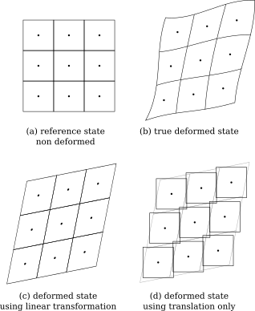
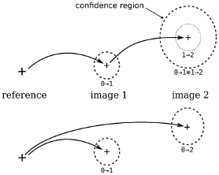

# stretchable corr

a Python code for Digital Image Correlation (DIC)

- **local method**: the displacemenent field between images is obtained using local cross-correlation computation.

The method used here corresponds to the figure (d) below:

## Workflow

- Load images from a given directory, sort by alphabetical order: get an **image sequence**.
- Construct a regular **grid** with a given spacing and margin value.
- Compute **cross-correlation** for every points[*]:
  * Using **Lagrangian** reference i.e. points are attached to the sample surface (track points).
  * Using **Eulerian** reference frame i.e. points remain fixed to the camera frame.
- Post-process & **graph**

[*] and image-to-image vs image-to-reference (see below)

## Links:

* jupyter notebook (use jupytext) for [correlations computation](https://github.com/xdze2/stretchablecorr/blob/master/run_corr.ipynb)
* jupyter notebook (use jupytext) for [post-process](https://github.com/xdze2/stretchablecorr/blob/master/post_process.ipynb)

* [**➡ Code documentation (docstrings)**](https://xdze2.github.io/stretchablecorr/stretchablecorr/index.html)
* [**➡ notes**](https://xdze2.github.io/stretchablecorr/)

## Tips 

- Extract images from video using [`ffmpeg`](https://ffmpeg.org/):

        ffmpeg -i test\ 2\ input_file.avi -qscale:v 4  ./output/output_%04d.tiff

- When naming the images, use number padding (0001.jpg, 0002.jpg, ...etc) to keep the correct order (use alphabetical sort)

- Record as many as possible images

## Displacement field description 

[Eulerian and Lagragian](https://en.wikipedia.org/wiki/Lagrangian_and_Eulerian_specification_of_the_flow_field) are two different way to describe the displacement field (or flow field) depending on which frame of reference is used:
- *Eulerian*: the laboratory or the camera field of view is used as reference, i.e. field evaluation points remain fixed on the images.
- *Lagrangian*: points on the sample surface are tracked. The frame of reference is fixed to the sample surface.

_Eulerian description_ corresponds to the simplest data processing approach, whereas _Lagrangian description_ require more complex data processing. Both are similar for small displacement.

## image-to-image vs image-to-reference

Another important consideration is related to the choice of the **reference state**. The displacement field is defined relatively to a non-deformed state. This, usualy, corresponds to the first image of the sequence.

Ideally, displacement for image `i` are directly computed using correlation between image `i` and the reference image. This is the **image-to-reference** approach.

However, large displacement or deformation could occur between these two images, leading to a wrong correlation estimation or simply displacement larger than the window size. An other method is to perform correlations between susccesive images and integrate (sum) instantateous displacements to obtain the absolute displacement. Performing correlation **image-to-image** is more robust albeit leading to the summation of correlation errors.

Therefore, at least four different combinations are possible to estimate the displacement field:

* either Eulerian or Lagrangian, 
* and image-to-image (relative) or image-to-reference (absolute) correlations.

> For the moment, Image-to-reference is not used. Image-to-reference displacement field is obtained by summation (`cumsum()`) of the image-to-image displacement field.

_note:_ **High order** correlation methods (for instance global DIC) are used to reduce the correlation error in the image-to-reference case.

Multi-image registration 

## Data structures

* `cube` : 3D array of floats with shape (nbr_images, height, width)  
    Sequence of gray-level images.  
    _note: ⚠ ij convention instead of xy_ --> height first

* `points` : 2D array of floats with shape (nbr_points, 2)  
    Coordinates of points (could be unstructured, i.e. not a grid).  
    (x, y) order

* `displ_field` : 3D array of floats with shape (nbr_images - 1, nbr_points, 2)  
    generic displacements field  
    could include NaNs

* `offsets` : 2D array of floats with shape (nbr_images - 1, 2)   
    image-to-image overall displacement  
    could include NaNs

## Pseudo multi-scale approach for robust processing

Similarly to iterative optimisation methods where choice of initial guess is important. The two images to be correlated have to be similar enough. When large displacement (>>50 pixels, larger than the ROI window size) occurs mutli-step methods are used.

Here a "2-scale" approach is used:

* first, run correlation image-to-image using downsampled images and large ROI → obtain `coarse_offsets` values
* second, run correlation image-to-image for all points of the grid, using previous offsets and smaller window size (~20px) 

## Cross-correlation methods

- The function [`phase-cross-correlation`](https://scikit-image.org/docs/stable/api/skimage.registration.html#phase-cross-correlation) from **scikit-image** could be used. Cross-correlation as pixel sampling is obtained using FFT. Sub-pixel precision is obtained employing an upsampled matrix-multiplication DFT [1].

[1] Manuel Guizar-Sicairos, Samuel T. Thurman, and James R. Fienup, “Efficient subpixel image registration algorithms,” Optics Letters 33, 156-158 (2008). DOI:10.1364/OL.33.000156

- Similar approach, but non-linear optimization ([BFGS](https://en.wikipedia.org/wiki/Broyden%E2%80%93Fletcher%E2%80%93Goldfarb%E2%80%93Shanno_algorithm)) is used to locate the cross-correlation peak. See `phase_registration_optim` function.

## Install

- download the repository (`git clone http://`, ...)
- `python --version` --> Python 3.6.9
- `$ pip install numpy scipy matplotlib scikit-image`
- `$ pip install numba` (optional) 

### for jupyter (optional) 

[jupyter notebooks and jupyter-lab](https://jupyter.org/) are web-based interactive development environment:

    $ pip install jupyter jupyterlab
    $ sudo apt-get install nodejs npm
    $ pip install jupytext  --upgrade

in jupyter-lab, search for command: `enable extension manager` then install **jupytext** extension.

The [jupytext](https://github.com/mwouts/jupytext) extension is used to automatically convert ̀̀ .ipynb` notebook file to a ̀`.py` runable python script.

## Development & code structure

There are 4 modules:
- filetools : functions used to load and sort images
- stretchablecorr : main set of function performing the processing
- graphplot : post-processing functions
- opti_registration : registration method using optimization & DFT for sub-pixel accuracy

### Documention

 use Github static site in the `/docs` folder

    $ source make_doc.sh

#### Docstrings

_note:_ [numpy's style](https://numpydoc.readthedocs.io/en/latest/format.html#docstring-standard) of docstrings is used

docstring to html is done using [pdoc](https://pdoc3.github.io/pdoc/)

    $ pdoc --html --output-dir docs stretchablecorr filetools --force

#### Markdown with math

* convert markdown file to html using [pandoc](https://pandoc.org/MANUAL.html). _simplest solution to display **math equation** online, with Katex_

* use pandoc's config file `pandoc.yaml` (need pandoc 2.10+)

        $ pandoc --defaults=pandoc.yaml

* and use simple **css style**

